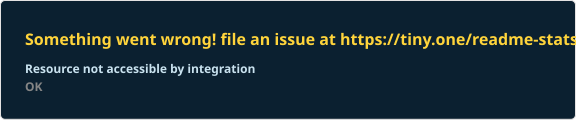

<!--
  ─────────────────────────────────────────────────────────────
  BEFORE YOU COMMIT — 3 things to check (search for "CHECK:")
    1. Repo slugs in "Selected work" — I guessed two of them.
    2. Your YouTube channel URL at the bottom.
    3. Run the two workflows in .github/workflows/ once each
       (Actions tab → Run workflow) so the stats + snake SVGs exist.
  ─────────────────────────────────────────────────────────────
-->

  

  
  
  
  

  
  

---

## 🧭 About me

<table>
  <tr>
    <td width="42" align="center">🎓</td>
    <td width="150"><b>Studying</b></td>
    <td>
      Master of Data Science <i>(in progress)</i> 
      
    </td>
  </tr>
  <tr>
    <td align="center">📐</td>
    <td><b>Before that</b></td>
    <td>
      MSc + BSc in Statistics — statistical theory and inference 
      
    </td>
  </tr>
  <tr>
    <td align="center">💼</td>
    <td><b>Doing now</b></td>
    <td>Power BI dashboards, Python and R analysis, SQL modelling</td>
  </tr>
  <tr>
    <td align="center">🎯</td>
    <td><b>Looking for</b></td>
    <td>Data analyst roles in Brisbane, Australia</td>
  </tr>
  <tr>
    <td align="center">🛂</td>
    <td><b>Work rights</b></td>
    <td>485 post-study work visa pathway</td>
  </tr>
  <tr>
    <td align="center">📍</td>
    <td><b>Based in</b></td>
    <td>Cairns, Queensland, Australia</td>
  </tr>
  <tr>
    <td align="center">✉️</td>
    <td><b>Reach me</b></td>
    <td><a href="mailto:nahid316unmad@gmail.com">nahid316unmad@gmail.com</a></td>
  </tr>
</table>

I came to data science from statistics. My MSc was in statistical theory and inference; the Master of Data Science at JCU is where that turns into working software and dashboards other people can actually use. **The gap between "the analysis is correct" and "the analysis is understood" is most of what I'm interested in.**

> I'd rather understand why a number moved than produce a chart faster.

---

## 🧰 Tools I work with

<h4 align="center">Analysis &amp; programming</h4>

  &nbsp;&nbsp;&nbsp;
  &nbsp;&nbsp;&nbsp;
  &nbsp;&nbsp;&nbsp;
  &nbsp;&nbsp;&nbsp;
  &nbsp;&nbsp;&nbsp;
  

<h4 align="center">Statistical software</h4>

  &nbsp;&nbsp;&nbsp;
  &nbsp;&nbsp;&nbsp;
  

<h4 align="center">Databases &amp; data processing</h4>

  &nbsp;&nbsp;&nbsp;
  &nbsp;&nbsp;&nbsp;
  &nbsp;&nbsp;&nbsp;
  &nbsp;&nbsp;&nbsp;
  

<h4 align="center">Visualisation &amp; reporting</h4>

  &nbsp;&nbsp;&nbsp;
  &nbsp;&nbsp;&nbsp;
  

Inside Power BI: DAX &nbsp;•&nbsp; Power Query / M &nbsp;•&nbsp; star-schema modelling &nbsp;•&nbsp; row-level security

<h4 align="center">Notebooks &amp; environments</h4>

  &nbsp;&nbsp;&nbsp;
  &nbsp;&nbsp;&nbsp;
  &nbsp;&nbsp;&nbsp;
  &nbsp;&nbsp;&nbsp;
  &nbsp;&nbsp;&nbsp;
  

<h4 align="center">Cloud &amp; workflow</h4>

  &nbsp;&nbsp;&nbsp;
  &nbsp;&nbsp;&nbsp;
  &nbsp;&nbsp;&nbsp;
  &nbsp;&nbsp;&nbsp;
  &nbsp;&nbsp;&nbsp;
  

---

## 🛠️ Selected work

<!-- CHECK: the first two repo names are my best guess — open each repo and
     confirm the slug in the address bar, then fix the links + pin cards below. -->

<table>
  <tr>
    <td width="30%">
      <a href="https://github.com/nahid-adnan/naplan-qld-equity-dashboard"><b>📊 NAPLAN QLD equity dashboard</b></a>
    </td>
    <td>
      Where the equity gaps sit in Queensland schooling — 1,369 schools, 3 report pages, a 60,236-row fact table.
      Suppressed results are handled as suppressed, not as zero.
    </td>
    <td width="22%">
      
      
      
    </td>
  </tr>
  <tr>
    <td>
      <a href="https://github.com/nahid-adnan/tasmania-short-stay-dashboard"><b>🏝️ Tasmania short-stay dashboard</b></a>
    </td>
    <td>
      5,293 listings and a $145.3M estimated revenue pool across 5 linked pages, with what-if repricing so a reader
      can test a scenario instead of asking for a new chart.
    </td>
    <td>
      
      
    </td>
  </tr>
  <tr>
    <td>
      <a href="https://github.com/nahid-adnan/blue-v-red"><b>🎮 blue-v-red</b></a>
    </td>
    <td>
      A probabilistic CLI game that logs every round to CSV and then analyses itself — the log is the dataset.
    </td>
    <td>
      
      
      
    </td>
  </tr>
  <tr>
    <td>
      <a href="https://github.com/nahid-adnan/cp5639-python-practicals"><b>🐍 cp5639-python-practicals</b></a>
    </td>
    <td>
      Six practicals working up from conditionals to structured data.
    </td>
    <td>
      
    </td>
  </tr>
  <tr>
    <td>
      <a href="https://github.com/nahid-adnan/cp1401-assignment-1"><b>💻 cp1401-assignment-1</b></a>
    </td>
    <td>
      Three Input-Process-Output programs.
    </td>
    <td>
      
    </td>
  </tr>
</table>

<!--
  These repo cards are generated by .github/workflows/readme-cards.yml and
  committed into assets/ — so they can never show as broken images.
  Uncomment once the workflow has run at least once.

  
  

-->

---

## 🧠 How I approach a dataset

<table>
  <tr>
    <td width="42" align="center">🔍</td>
    <td><b>Understand the gaps before the numbers.</b> Missing and suppressed values are decisions, not noise. Treating a suppressed result as zero quietly turns an unreported school into a failing one.</td>
  </tr>
  <tr>
    <td align="center">📐</td>
    <td><b>Encode for accuracy, not decoration.</b> Position and length where a reader must compare precisely; colour and area only for secondary information.</td>
  </tr>
  <tr>
    <td align="center">📋</td>
    <td><b>State the limitations on the page.</b> A dashboard that hides its own coverage problems isn't defensible when someone quotes it in a briefing.</td>
  </tr>
  <tr>
    <td align="center">🔁</td>
    <td><b>Build it so it can be rebuilt.</b> Documented transformations, named measures, a model someone else can open and follow.</td>
  </tr>
  <tr>
    <td align="center">🎯</td>
    <td><b>Design for the reader, not the analyst.</b> A time-poor officer should get something useful in the first five seconds, before touching a filter.</td>
  </tr>
</table>

---

## 📊 GitHub in numbers

<!--
  These two cards are generated nightly by .github/workflows/readme-cards.yml
  and committed to this repo, so the numbers are real and the images never
  break. Run that workflow once before your first push.
-->

  
  

  
  

---

## 🐍 Contributions, eaten in Python colours

  <picture>
    <source media="(prefers-color-scheme: dark)"  srcset="https://raw.githubusercontent.com/nahid-adnan/nahid-adnan/output/snake-dark.svg">
    <source media="(prefers-color-scheme: light)" srcset="https://raw.githubusercontent.com/nahid-adnan/nahid-adnan/output/snake-light.svg">
    
  </picture>

Yellow snake on Python blue in dark mode, blue snake on Python yellow in light mode. Regenerates every 12 hours.

---

<h3 align="center">Say hello</h3>

  
  &nbsp;&nbsp;&nbsp;&nbsp;
  
  &nbsp;&nbsp;&nbsp;&nbsp;
  
  &nbsp;&nbsp;&nbsp;&nbsp;
  <!-- CHECK: paste your real YouTube channel URL here -->
  

