  

  
  
  

---

## 🤖 About me

  

<b>Statistics came first. My MSc at Jahangirnagar was in theory and inference — estimators, sampling distributions, the conditions under which a number is allowed to mean anything. That training left me suspicious of results that look clean, which turns out to be the useful part.</b>

<b>Building the NAPLAN equity dashboard, the hard problem was never the visuals. Queensland suppresses results for small cohorts, and a suppressed value read as zero quietly turns an unreported school into a failing one. Getting that single decision right mattered more than anything else on the page.</b>

<b>So most of my attention goes to the unglamorous half — what's missing, what the model genuinely can't answer, whether someone could rebuild it in six months without me. The Master of Data Science at JCU is where that becomes software: a Power BI report an officer opens without a walkthrough, Python that behaves the same way next month, SQL another analyst can read.</b>

  

  
  

  
  
  
  

  
  
  
  

  
  
  
  
  

---

## 🧰 Tools I work with

  

Inside Power BI: DAX &nbsp;•&nbsp; Power Query / M &nbsp;•&nbsp; star-schema modelling &nbsp;•&nbsp; row-level security

---

## 🛠️ Selected work

<table>
  <tr>
    <td width="30%">
      <a href="https://github.com/nahid-adnan/naplan-qld-equity-dashboard"><b>📊 NAPLAN QLD equity dashboard</b></a>
    </td>
    <td>
      Where the equity gaps sit in Queensland schooling — 1,369 schools, 3 report pages, a 60,236-row fact table.
      Suppressed results are handled as suppressed, not as zero.
    </td>
    <td width="22%">
      
      
      
    </td>
  </tr>
  <tr>
    <td>
      <a href="https://github.com/nahid-adnan/tasmania-short-stay-dashboard"><b>🏝️ Tasmania short-stay dashboard</b></a>
    </td>
    <td>
      5,293 listings and a $145.3M estimated revenue pool across 5 linked pages, with what-if repricing so a reader
      can test a scenario instead of asking for a new chart.
    </td>
    <td>
      
      
    </td>
  </tr>
  <tr>
    <td>
      <a href="https://github.com/nahid-adnan/blue-v-red"><b>🎮 blue-v-red</b></a>
    </td>
    <td>
      A probabilistic CLI game that logs every round to CSV and then analyses itself — the log is the dataset.
    </td>
    <td>
      
      
      
    </td>
  </tr>
  <tr>
    <td>
      <a href="https://github.com/nahid-adnan/cp5639-python-practicals"><b>🐍 cp5639-python-practicals</b></a>
    </td>
    <td>
      Six practicals working up from conditionals to structured data.
    </td>
    <td>
      
    </td>
  </tr>
  <tr>
    <td>
      <a href="https://github.com/nahid-adnan/cp1401-assignment-1"><b>💻 cp1401-assignment-1</b></a>
    </td>
    <td>
      Three Input-Process-Output programs.
    </td>
    <td>
      
    </td>
  </tr>
</table>

---

## 🧠 How I approach a dataset

<table>
  <tr>
    <td width="42" align="center">🔍</td>
    <td><b>Understand the gaps before the numbers.</b> Missing and suppressed values are decisions, not noise. Treating a suppressed result as zero quietly turns an unreported school into a failing one.</td>
  </tr>
  <tr>
    <td align="center">📐</td>
    <td><b>Encode for accuracy, not decoration.</b> Position and length where a reader must compare precisely; colour and area only for secondary information.</td>
  </tr>
  <tr>
    <td align="center">📋</td>
    <td><b>State the limitations on the page.</b> A dashboard that hides its own coverage problems isn't defensible when someone quotes it in a briefing.</td>
  </tr>
  <tr>
    <td align="center">🔁</td>
    <td><b>Build it so it can be rebuilt.</b> Documented transformations, named measures, a model someone else can open and follow.</td>
  </tr>
  <tr>
    <td align="center">🎯</td>
    <td><b>Design for the reader, not the analyst.</b> A time-poor officer should get something useful in the first five seconds, before touching a filter.</td>
  </tr>
</table>

---

## 📊 GitHub stats

  

  
  

  

  

---

## 🐍 Contribution snake

  

Regenerates every 12 hours.

---

<h3 align="center">Where You Can Find Me</h3>

  &nbsp;&nbsp;
  &nbsp;&nbsp;
  &nbsp;&nbsp;
  &nbsp;&nbsp;
  

Open to data analyst roles. Always happy to talk data, dashboards, or statistics.

